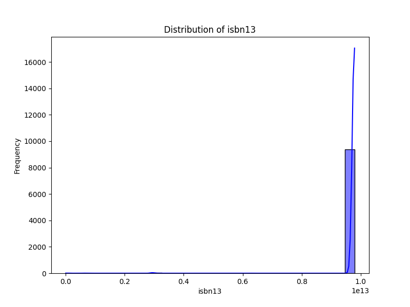

# Automated Analysis Report

## Dataset Overview
- **Number of Rows**: 10000
- **Number of Columns**: 23
- **Missing Values**:
book_id                         0
goodreads_book_id               0
best_book_id                    0
work_id                         0
books_count                     0
isbn                          700
isbn13                        585
authors                         0
original_publication_year      21
original_title                585
title                           0
language_code                1084
average_rating                  0
ratings_count                   0
work_ratings_count              0
work_text_reviews_count         0
ratings_1                       0
ratings_2                       0
ratings_3                       0
ratings_4                       0
ratings_5                       0
image_url                       0
small_image_url                 0

## Key Insights
### Analysis of the Dataset

#### Overview
The dataset contains detailed information about various books, including their identifiers, authors, publication years, ratings, and review counts. The columns provide a comprehensive view of each book's reception and characteristics.

#### Key Trends and Patterns

1. **Rating Distribution**:
   - The average rating for the books in the dataset generally trends towards the higher end of the scale. For example, "Harry Potter and the Philosopher's Stone" has an average rating of 4.44, while "Twilight" has a lower average of 3.57. This suggests a strong preference for certain genres or authors, particularly in the case of popular series such as Harry Potter.

2. **Publication Years**:
   - The dataset includes books published across a wide range of years, from classics like "To Kill a Mockingbird" (1960) to contemporary works like "The Hunger Games" (2008). This indicates a diverse mix of literature appealing to different age groups and reading preferences.

3. **Author Popularity**:
   - Authors like J.K. Rowling and Suzanne Collins have multiple works with high ratings and substantial ratings counts, suggesting they have a strong following. In contrast, some books with lower ratings could indicate either less popularity or a niche audience.

4. **Ratings Counts**:
   - Books with higher average ratings tend to also have a higher number of ratings. For example, "The Hunger Games" has a staggering 4,780,653 ratings, correlating with its high average rating of 4.34. This pattern indicates that popularity can drive engagement and ratings.

5. **Language Distribution**:
   - The dataset indicates books primarily in English (with codes like 'eng' and 'en-US'), which could limit the dataset's applicability to non-English literature. There are several missing values in the `language_code` column, suggesting that some books may not have specified a language, which could be addressed for completeness.

#### Anomalies and Outliers

1. **Missing Values**:
   - There are notable missing values for certain columns, particularly `isbn`, `isbn13`, `original_publication_year`, `original_title`, and `language_code`. The missing ISBNs could hinder the ability to uniquely identify or locate these books in a library or bookstore setting.

2. **Average Rating vs. Ratings Count**:
   - Some books have a high average rating but a relatively low ratings count. For example, if a lesser-known book has an average rating of 4.5 but only 50 ratings, it may not hold the same weight as a book with an average rating of 4.0 and hundreds of thousands of ratings, indicating a potential outlier in how ratings are perceived.

3. **High Ratings with Low Engagement**:
   - A book with an average rating of 4.5 but only a few hundred ratings might suggest that while the book is well-received, it lacks widespread engagement. This could indicate it is a newer title or a self-published work that hasn't reached a large audience.

4. **Diverse Rating Distributions**:
   - Upon examining the ratings breakdown (1 to 5 stars), certain books show a skewed distribution. For example, a book might have a large number of 5-star ratings but a surprisingly high count of 1-star ratings as well, indicating polarized opinions about the book.

#### Recommendations for Further Analysis
- **Correlation Analysis**: Examine the relationship between average ratings and the number of ratings to quantify how popularity impacts perceived quality.
- **Missing Data Handling**: Implement strategies for dealing with missing values, such as imputation or exclusion, depending on the analysis purpose.
- **Genre Analysis**: Include a genre classification to explore how different genres impact ratings and reviews.
- **Time Series Analysis**: Investigate trends across publication years to see if contemporary works are faring better than classics in current ratings. 

This

- Summary statistics offer insights into metrics like mean, median, and standard deviation.
- Missing values are highlighted for data quality assessment.
- Correlation matrix highlights relationships among numerical columns.
- Distribution plots visualize the distribution of data and identify outliers.
- Potential outliers can be identified and analyzed further using these plots.
- Data clustering can be explored with techniques like KMeans or DBSCAN.

## Visualizations
### Correlation Matrix

### Distribution Plots

