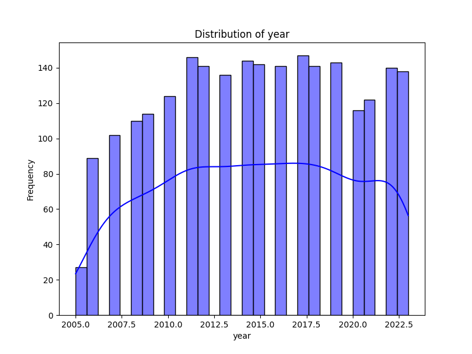
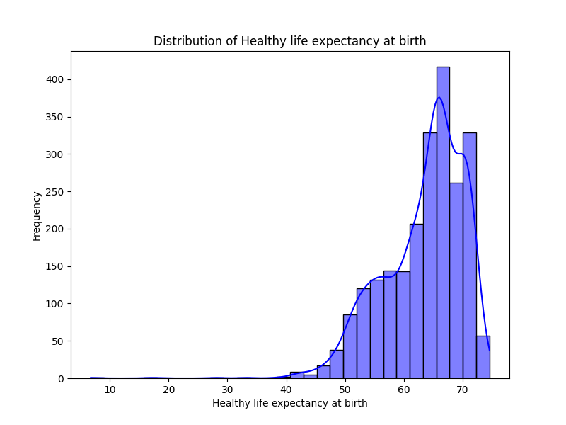
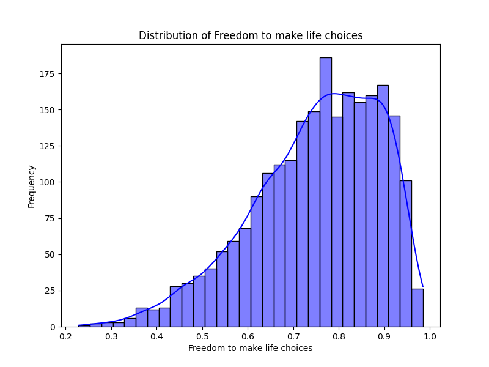
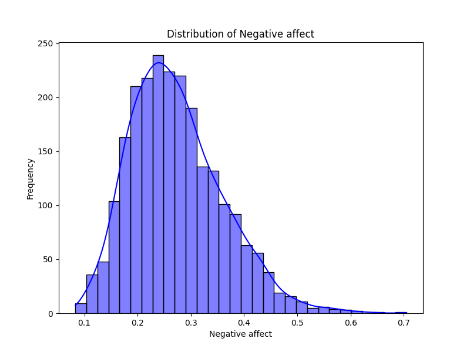

# Automated Analysis Report

## Dataset Overview
- **Number of Rows**: 2363
- **Number of Columns**: 11
- **Missing Values**:
Country name                          0
year                                  0
Life Ladder                           0
Log GDP per capita                   28
Social support                       13
Healthy life expectancy at birth     63
Freedom to make life choices         36
Generosity                           81
Perceptions of corruption           125
Positive affect                      24
Negative affect                      16

## Key Insights
Based on the provided dataset overview, we can derive several key insights regarding the relationships between various socio-economic indicators and well-being as represented by the "Life Ladder" score, which is a measure of subjective well-being.

### Key Trends and Patterns:

1. **Economic Correlation**:
   - The "Log GDP per capita" appears to have a positive correlation with "Life Ladder" scores. Generally, higher GDP per capita is associated with higher life satisfaction, suggesting that economic prosperity contributes positively to well-being.

2. **Social Support**:
   - "Social support" also shows a positive relationship with the "Life Ladder." Countries with higher social support scores tend to have higher life satisfaction, indicating the importance of community and social networks in enhancing well-being.

3. **Healthy Life Expectancy**:
   - There is likely a relationship between "Healthy life expectancy at birth" and "Life Ladder." Higher life expectancy generally correlates with better health and well-being, although the strength of this correlation would need to be statistically tested.

4. **Freedom and Life Choices**:
   - The "Freedom to make life choices" metric is another significant factor contributing to life satisfaction. Countries that allow individuals greater freedom generally report higher "Life Ladder" scores, reflecting the value of autonomy in people's lives.

5. **Generosity and Corruption**:
   - The "Generosity" score is notably low across many observations, with a significant number of missing values (81). This may suggest that in many countries, altruistic behavior does not significantly impact well-being or that it is underreported.
   - "Perceptions of corruption" also show a negative correlation with "Life Ladder." Higher perceived corruption is likely associated with lower life satisfaction, indicating that trust in governance and institutions plays a crucial role.

6. **Affects**:
   - "Positive affect" tends to correlate positively with "Life Ladder," while "Negative affect" shows an inverse correlation. Higher levels of positive emotions contribute to higher life satisfaction, whereas negative emotions detract from it.

### Anomalies and Outliers:

1. **Missing Data**:
   - There are considerable missing values in the "Log GDP per capita," "Social support," "Healthy life expectancy at birth," "Freedom to make life choices," "Generosity," "Perceptions of corruption," "Positive affect," and "Negative affect." Countries with missing data might skew overall insights, and special attention should be given to how these gaps are addressed in analysis.

2. **Extreme Values**:
   - Countries with very low "Life Ladder" scores, such as Afghanistan in the provided sample, indicate outliers in the dataset. The values for "Life Ladder" (e.g., 3.724 in 2008) are significantly lower than those in more prosperous nations, suggesting a distinct disparity in well-being based on socio-economic conditions.

3. **Temporal Trends**:
   - Observing changes over the years for a specific country, like Afghanistan, shows fluctuations in "Life Ladder," suggesting external factors (e.g., wars, economic changes) might influence these scores significantly. For instance, despite some years showing improvement, the overall trend appears volatile.

### Conclusion:

The dataset reveals important relationships between economic indicators, social support, and life satisfaction. While there are clear trends that suggest higher GDP, better health, and social support contribute to greater well-being, anomalies such as missing data and extreme values highlight the need for careful interpretation. Further analysis using statistical methods would be necessary to quantify these relationships and validate the trends observed.

- Summary statistics offer insights into metrics like mean, median, and standard deviation.
- Missing values are highlighted for data quality assessment.
- Correlation matrix highlights relationships among numerical columns.
- Distribution plots visualize the distribution of data and identify outliers.
- Potential outliers can be identified and analyzed further using these plots.
- Data clustering can be explored with techniques like KMeans or DBSCAN.

## Visualizations
### Correlation Matrix

### Distribution Plots

