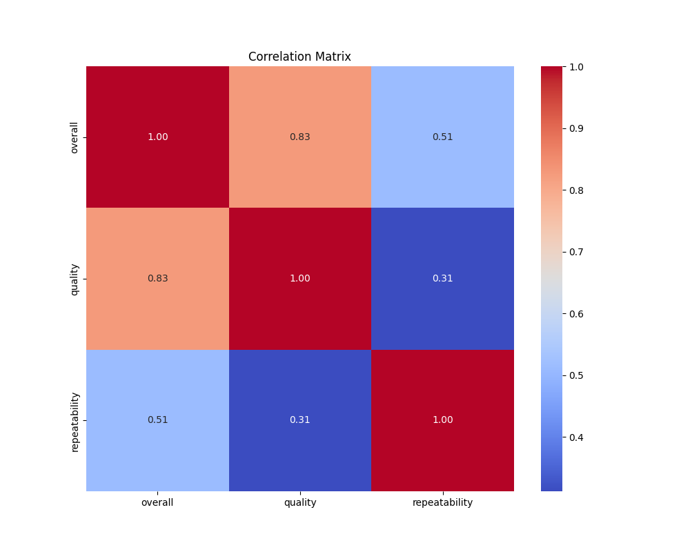
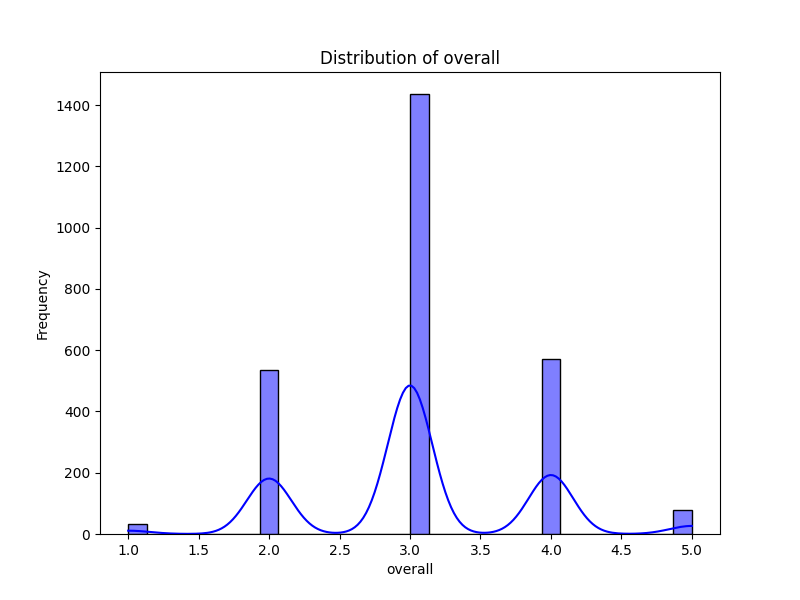
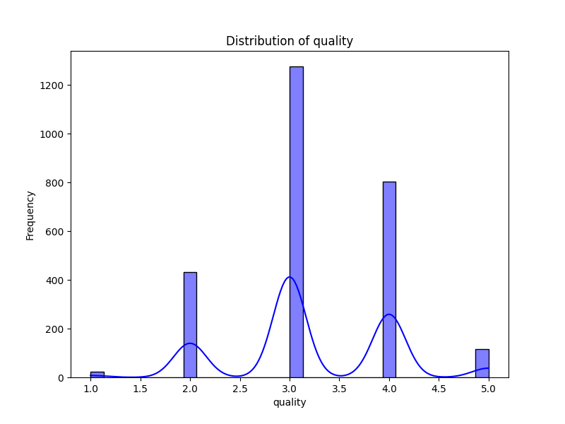
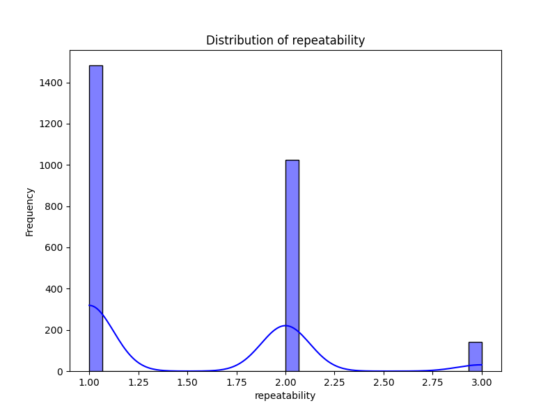

# Automated Analysis Report

## Dataset Overview
- **Number of Rows**: 2652
- **Number of Columns**: 8
- **Missing Values**:
date              99
language           0
type               0
title              0
by               262
overall            0
quality            0
repeatability      0

## Key Insights
Based on the provided dataset overview, we can identify several key trends, patterns, and relationships:

### Key Trends and Patterns

1. **Language Distribution**:
   - The dataset includes entries in at least two languages: Tamil and Telugu. A deeper analysis into the distribution of entries by language may reveal preference trends among viewers or content producers.

2. **Type of Content**:
   - All entries are categorized under the type "movie". This consistency simplifies the analysis but may limit insights into other content types (e.g., TV shows, documentaries).

3. **Overall Ratings**:
   - The overall ratings seem to range from 1 to 5, with multiple entries showing high ratings (4 and 5). This suggests a generally positive reception for the movies listed, although a closer look at the distribution of ratings will help gauge viewer satisfaction levels more accurately.

4. **Quality Ratings**:
   - Similar to overall ratings, quality ratings also range from 1 to 5. The correlation between overall ratings and quality ratings could be explored to understand how viewers perceive the quality of the films in relation to their overall experience.

5. **Repeatability**:
   - All entries have a repeatability score of 1, indicating that these movies are considered to be one-time watches. This might suggest that these films do not have high rewatch value, which could be an area of concern for producers or marketers.

### Relationships and Correlations

- **Overall vs. Quality Ratings**:
   - A strong positive correlation is expected between overall ratings and quality ratings; higher quality ratings should correspond to higher overall ratings. A scatter plot or correlation coefficient analysis could reveal the strength of this relationship.

- **Influence of Cast**:
   - The "by" column lists the actors involved. Analyzing the relationship between actors and overall ratings could uncover patterns, such as whether movies featuring popular actors tend to receive higher ratings.

### Anomalies or Outliers

1. **Low Ratings**:
   - The movie "Vettaiyan" has an overall rating of 2 and a quality rating of 2, indicating it is perceived poorly relative to others in the dataset. This could be an outlier that warrants further investigation into its reception.

2. **Missing Values**:
   - There are 99 missing values in the "date" column and 262 missing entries in the "by" column. The missing values in the "by" column, which represents the contributors to the films, may hinder a complete analysis of the relationship between cast and ratings.

3. **Temporal Trends**:
   - The dataset appears to cover movies released in late 2024, and a time series analysis could reveal temporal trends in ratings. For instance, are newer movies rated higher than older ones? 

### Conclusion

Overall, while the dataset suggests a generally positive reception for the movies listed, there are clear areas for deeper analysis. The disparity in ratings for certain films, the impact of cast on overall ratings, and the implications of missing data should be investigated further. Anomalies, particularly low-rated movies, could provide valuable insights into viewer preferences and the factors affecting movie success.

- Summary statistics offer insights into metrics like mean, median, and standard deviation.
- Missing values are highlighted for data quality assessment.
- Correlation matrix highlights relationships among numerical columns.
- Distribution plots visualize the distribution of data and identify outliers.
- Potential outliers can be identified and analyzed further using these plots.
- Data clustering can be explored with techniques like KMeans or DBSCAN.

## Visualizations
### Correlation Matrix

### Distribution Plots

